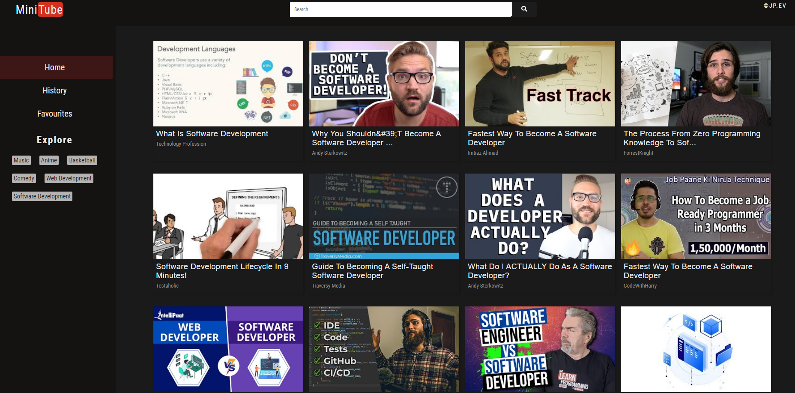

# MiniTube

> Pocket YouTube application

---

### Table of Contents

Sections headers used to reference location of destination.

- [Demo](#demo)
- [Description](#description)
- [How To Use](#how-to-use-in-your-local-environment)
- [API reference](#api-used-reference)
- [Author Info](#author-info)

---

## Demo

> View demo at: https://mini-tube.netlify.app/

---

## Description

A miniature version of the ever popular video sharing platform - YouTube. This is a single-paged application project to solidify my understanding on the React.js library. This application makes use of the public YouTube API to display videos based on the search term.

Its main functionalities are: to display and watch YouTube videos, show related videos based on the video clicked, ability to favourite any chosen videos (using local storage) as well as record the viewing history of the user.

Uses hooks and Context API for state management, react-icons for presentation purposes, axios library for fetching data and react-router-dom library for routing

#### Technologies

- Visual Code Studio
- React.js
- JavaScript
- Markdown
- HTML & CSS (SASS)
- UI/UX
- Responsive
- YouTube API

[Back To The Top](#minitube)

---

## How to use in your local environment

#### Prerequisites

- You must have node.js installed to have npm
- Clone this repository

#### Installation

`npm install && npm start `

---

## API used reference

YouTube API: https://developers.google.com/youtube/v3/getting-started

[Back To The Top](#minitube)

---

## Author Info

- linkedIn - [@jpev.dev](https://linkedin.com/in/jianneevangelista)
- Website - [jp.ev](https://jpce.netlify.app/)

[Back To The Top](#minitube)
